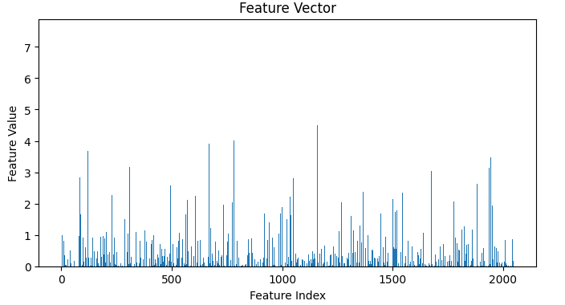

# Clothing Recommendation System

## Introduction

This project aims to create a clothing recommendation system that suggests similar items based on user-uploaded images. It utilizes the VITON HD dataset, a high-resolution clothing dataset, and employs the ResNet50 model for feature extraction. Pinecone is used for efficient storage and querying of vector embeddings.

## Dataset Description

The VITON HD dataset, available on Kaggle, is a high-resolution clothing image dataset with the following characteristics:
- **Number of Images:** Over 10,000 high-resolution images
- **Content:** Diverse clothing items categorized into various classes

For more details, visit: [VITON HD Dataset on Kaggle](https://www.kaggle.com/datasets/marquis03/high-resolution-viton-zalando-dataset).

## Model and Feature Extraction

The system uses the ResNet50 model for feature extraction:
- **Model Used:** ResNet50, a pre-trained Convolutional Neural Network (CNN)
- **Feature Vector:** Converts images into 2048-dimensional feature vectors
- **Embedding Storage:** Vector embeddings are managed efficiently by Pinecone

Refer to the [Keras Documentation](https://keras.io/api/applications/resnet/) for more information about ResNet50.

## System Workflow

The recommendation system operates as follows:
1. **Image Upload:** Users log in and upload an image of clothing.
   - 
   - 
2. **Feature Extraction:** The uploaded image is processed through ResNet50 to extract features.
   - 
   - 
3. **Querying Pinecone:** The extracted feature vector queries Pinecone for similar clothing items.
   - 
4. **Results Display:** The top 10 similar items are retrieved and displayed to the user based on similarity scores.
   - 

## Results

The recommendation system successfully identifies and suggests similar clothing items based on user-uploaded images. Recommendations are sorted by similarity score. While specific training accuracy metrics are not available due to the use of a pre-trained model, the effectiveness of recommendations is demonstrated through practical use.

## Future Work

Potential improvements include:
- **Feature Selection:** Allow users to filter recommendations based on attributes like color, shape, size, and brand.
- **Model Enhancement:** Explore advanced neural network architectures and transfer learning techniques to improve recommendation quality.
- **User Experience:** Refine the web application to enhance user interaction, with features like real-time recommendations and personalized suggestions.

## Conclusion

This clothing recommendation system effectively utilizes a pre-trained model and Pinecone for vector search, providing valuable recommendations based on user-uploaded images. Future work will focus on model refinement and enhancing user experience.

## References

1. VITON HD Dataset. Available: [VITON HD Dataset on Kaggle](https://www.kaggle.com/datasets/marquis03/high-resolution-viton-zalando-dataset).
2. Keras Documentation. Available: [Keras ResNet Documentation](https://keras.io/api/applications/resnet/).
3. Pinecone Documentation. Available: [Pinecone Documentation](https://www.pinecone.io/docs/).
 
